# Welcome to CommunityConnect 🏙️

Welcome to the **CommunityConnect** repository. This is a native Android application for neighborhood engagement. It allows residents to report local issues, participate in surveys, join community discussions, and explore a directory of local resources.

---

## 📚 About The Project

| Feature                | Details |
| ---------------------- | ------- |
| 🎯 **Purpose**         | A platform for residents to report neighborhood issues, participate in surveys, join forums, and explore local resources. |
| ⚙️ **Architecture**     | Built using a multi-activity Android architecture utilizing Kotlin and traditional XML View-based layouts. |
| 💾 **Data Management** | Real-time data synchronization and role-based access control powered by Firebase Firestore. |
| 🔄 **Core Operations** | Secure authentication, role-based feature gating (Admin vs. Citizen), dynamic polling, forum discussions, and civic reporting. |

---

## 🚀 Tech Stack

### Android & UI


- **Kotlin & Android SDK:** The core application logic, utilizing standard Android Activities and Adapters.
- **XML Layouts:** Fully custom user interface built with `ConstraintLayout`, `RecyclerView`, and custom drawable shapes for a unique visual identity.
- **Material Components:** Usage of Bottom App Bars, Floating Action Buttons, and Bottom Sheets for navigation and interactions.

### Backend & Database


- **Firebase Authentication:** Handles user onboarding via Email and Password.
- **Firebase Firestore:** A NoSQL cloud database handling real-time posts, poll increments, report submissions, and user roles.

---

## 🔧 Highlighted Features

| Feature | Description |
|--------|------------|
| **Role-Based Access** | Supports `Citizen` and `Admin` roles. Admins can create polls and review submitted reports. |
| **Interactive Surveys** | 4-question polls with a visual rating scale (0, 5, 10), percentage calculation, and result display. |
| **Civic Reporting** | Forms for reporting local problems (Environmental, Security, etc.) with date selection and detailed descriptions. |
| **Community Forums** | A space for users to publish and read discussions, with sorting and filtering by user, date, or title. |
| **Resource Directory** | A categorized local directory (Parks, Offices, Hospitals, Museums) allowing users to quickly find local services and schedules. |

---

## 📸 Screenshots

### Citizen User

<div align="center">
  <table align="center">
    <tr>
      <td align="center">
        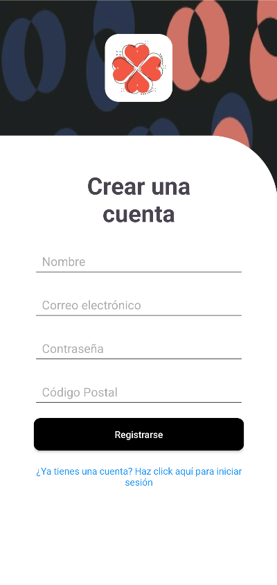
      </td>
      <td align="center">
        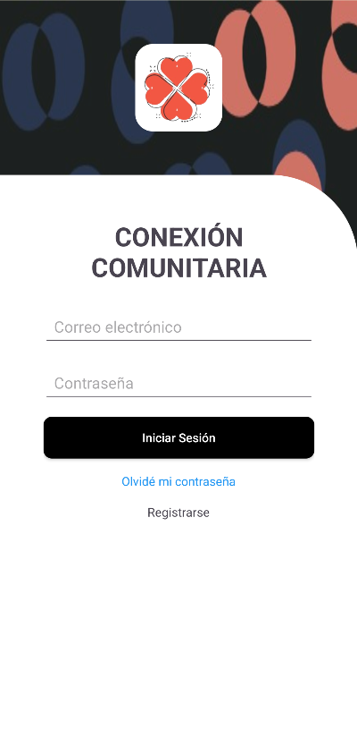
      </td>
      <td align="center">
        
      </td>
      <td align="center">
        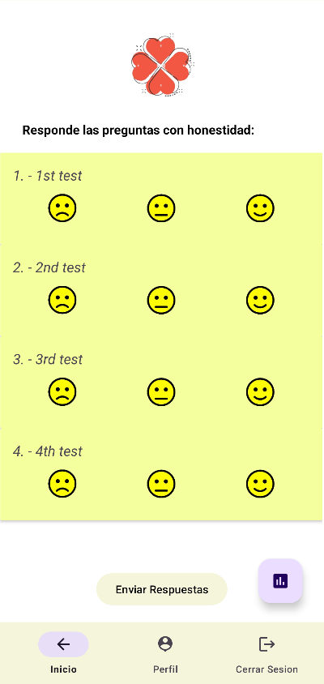
      </td>
    </tr>
    <tr>
      <td align="center">
        
      </td>
      <td align="center">
        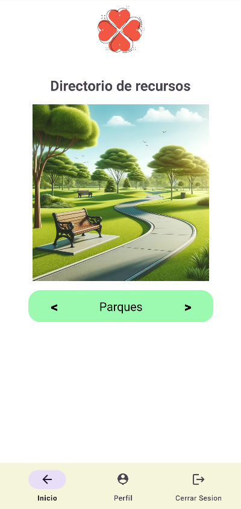
      </td>
      <td align="center">
        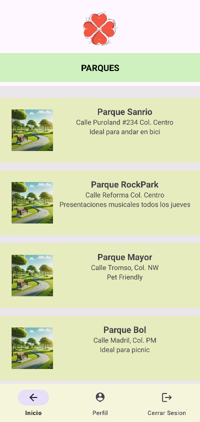
      </td>
      <td align="center">
        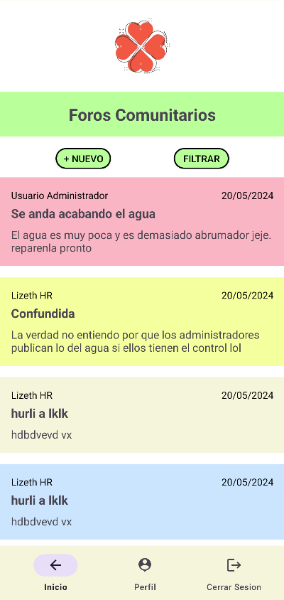
      </td>
    </tr>
    <tr>
      <td align="center">
        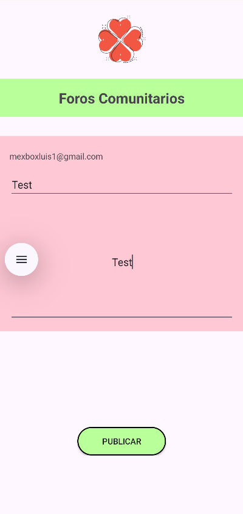
      </td>
      <td align="center">
        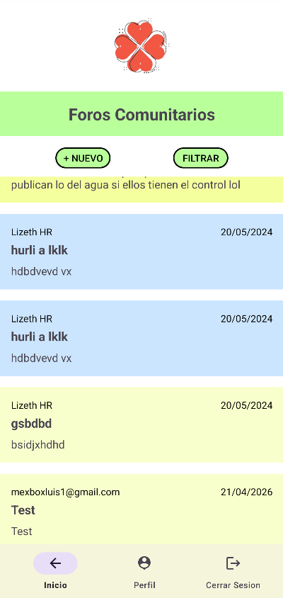
      </td>
      <td align="center">
        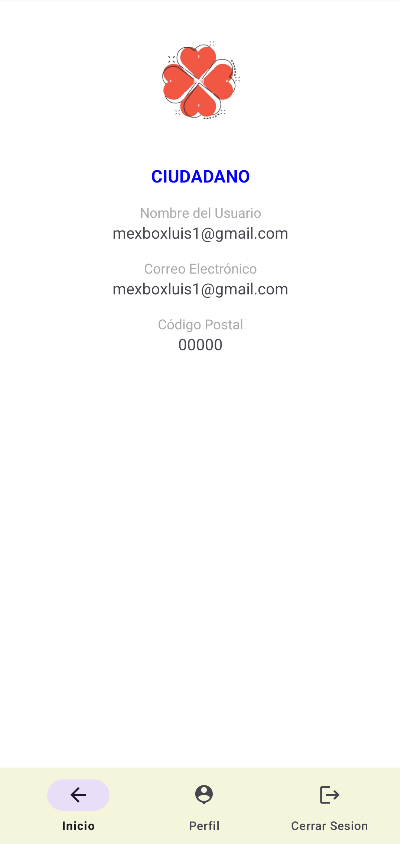
      </td>
      <td align="center">
        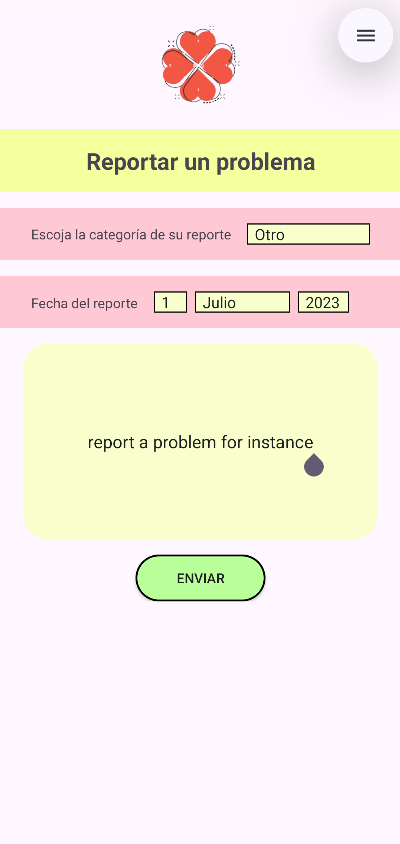
      </td>
    </tr>
  </table>
</div>

### Admin User

<div align="center">
  <table align="center">
    <tr>
      <td align="center">
        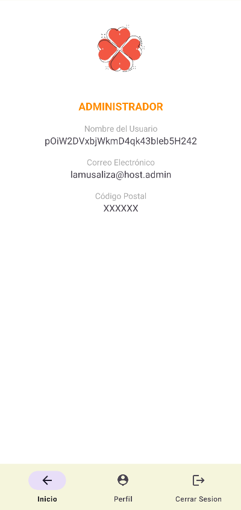
      </td>
      <td align="center">
        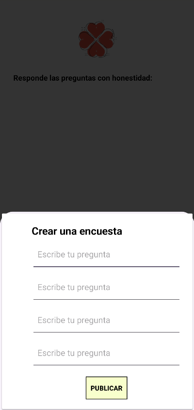
      </td>
      <td align="center">
        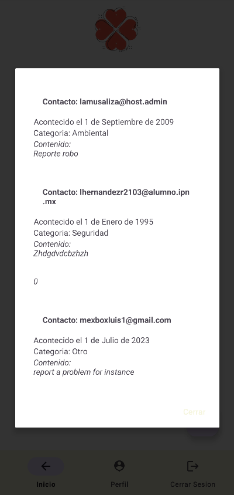
      </td>
    </tr>
  </table>
</div>


## 🛠️ How to Run Locally

### 1. Clone the repository
```bash
git clone https://github.com/MexboxLuis/CommunityConnect.git
cd CommunityConnect
```

### 2. Open the project

Launch Android Studio, select **Open an existing project**, and navigate to the cloned folder.

### 3. Firebase Setup

1. Go to the Firebase Console and create a new project.
2. Add an Android app (ensure the package name matches `com.example.conexioncomunitaria`).
3. Download the `google-services.json` file.
4. Place the file inside the `app/` directory of the project.
5. Enable **Firestore Database** and **Authentication (Email/Password)**.

### 4. Build and Run

Click **Sync Project with Gradle Files** in Android Studio.  
Once synced, select your emulator or physical device and click **Run (Shift + F10)**.

---

## 🎨 Credits

Special thanks to [@lamusaliza](https://github.com/lamusaliza) for the original UI design concepts and visual inspiration used throughout this application.

